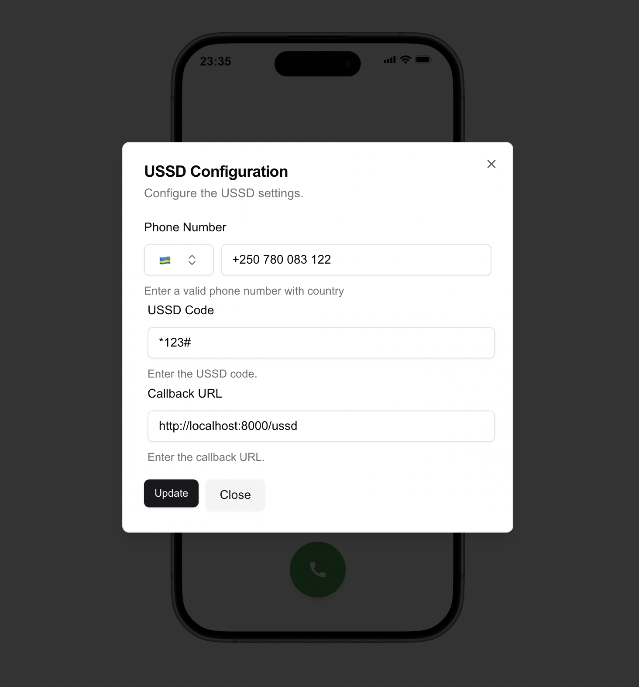
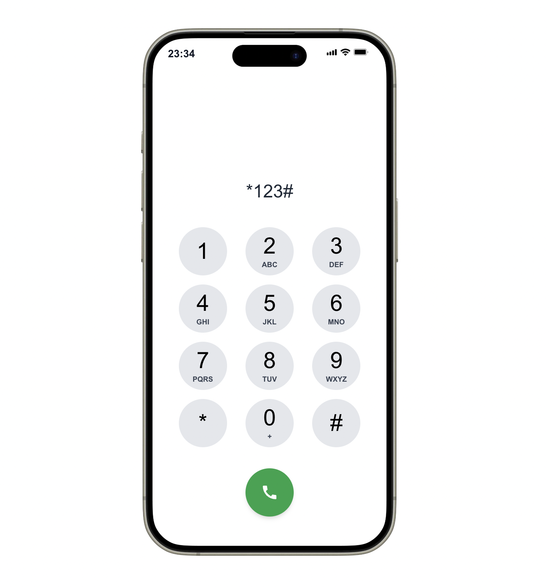

# USSD Simulator

The USSD Simulator is a web-based application designed to simulate the user
experience of interacting with USSD (Unstructured Supplementary Service Data)
applications. It allows developers to test USSD flows and logic in a browser
environment, providing a highly configurable and extensible architecture for
building and debugging USSD applications.

---

## Features

- **USSD Code Validation**: Supports validation of USSD codes to ensure
  adherence to proper syntax.
- **Session Management**: Simulates USSD sessions with unique session IDs.
- **Configurable Phone UI**: Provides a realistic phone interface with status
  bars, input fields, keypads, and action buttons.
- **Dynamic Response Handling**: Displays `CON` (continue) and `END` responses,
  simulating real USSD interactions.
- **Zustand State Management**: Stores configuration settings like phone
  numbers, USSD codes, and callback URLs.
- **Customizable Backend Integration**: Sends requests to a configured backend
  to simulate real-world USSD flows.
- **Keypad and Navigation**: Includes a fully functional keypad for user input
  and navigation.
- **Loading and Response Screens**: Mimics the experience of loading indicators
  and response messages.

---

## Demo

### Configuration Modal



### USSD Interface



---

## Installation

1. Clone the repository:

   ```bash
   git clone https://github.com/barackm/ussdsimulator.git
   ```

2. Install dependencies:

   ```bash
   npm install
   ```

3. Start the development server:

   ```bash
   npm run dev
   ```

---

## Usage

- Open the simulator in your browser.
- Enter the USSD code and interact with the keypad to simulate USSD flows.
- Use the configuration modal to update settings such as phone number, callback
  URL, and USSD code.

---

## Configuration

You can configure the simulator using the `UssdConfigModal`. Key settings
include:

- **Phone Number**: The simulated user's phone number.
- **USSD Code**: The code to initiate a USSD session.
- **Callback URL**: The backend URL to handle USSD requests.

---

## License

This project is licensed under the MIT License.
